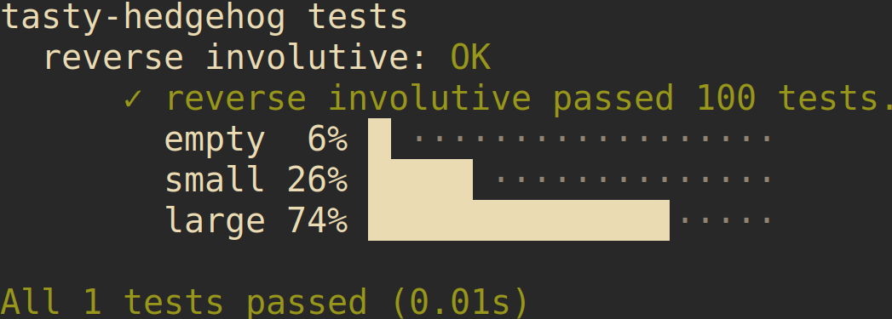
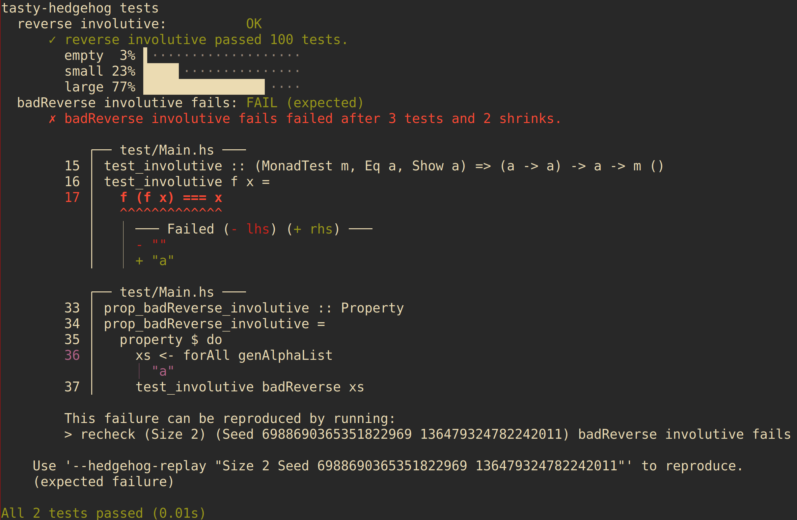

[](https://travis-ci.org/qfpl/tasty-hedgehog)
[](http://stackage.org/nightly/package/tasty-hedgehog)
[](http://stackage.org/lts/package/tasty-hedgehog)
[](http://hackage.haskell.org/package/tasty-hedgehog)

# `tasty-hedgehog`

This provides [`tasty`]( https://hackage.haskell.org/package/tasty) integration for [`hedgehog`]( https://hackage.haskell.org/package/hedgehog).

## An example of usage

We're going to need some toy examples to show how this is meant to work.

(If you want to look at the whole file that this example comes from, which includes all of the necessary imports, it is [here](https://github.com/qfpl/tasty-hedgehog/blob/master/test/Main.hs))

We're going to use the simplest example of a property that we can find: if you reverse a list, and then reverse it again, you end up with the list that you started with.

If were to use the formal term for that, we would say that the `reverse` function is _involutive_.

To test this, we'll need a random list generated by `hedgehog`:
```haskell
genAlphaList :: Gen String
genAlphaList =
  Gen.list (Range.linear 0 100) Gen.alpha
```

We'll also need something to test that a function is involutive, which might sound scarier than the implementation:
```haskell
test_involutive :: (MonadTest m, Eq a, Show a) => (a -> a) -> a -> m ()
test_involutive f x =
  f (f x) === x
```

Thus armed, we write a property to test that the reverse function is actually involutive:
```haskell
prop_reverse_involutive :: Property
prop_reverse_involutive =
  property $ do
    xs <- forAll genAlphaList
    -- hedgehog-1.0 introduced a classification feature
    -- it's optional, but we use it here for fun :)
    classify "empty" $ length xs == 0
    classify "small" $ length xs < 10
    classify "large" $ length xs >= 10
    test_involutive reverse xs
```

(We're only testing with lists of `Char`, but the type signature of `reverse` lets us know that the type of the elements of the list can't effect how the function works, via _parametricity_)

We can now use `tasty` to run the `hedgehog` tests for that property in a test executable:
```haskell
main :: IO ()
main =
  defaultMain $
  testGroup "tasty-hedgehog tests"
    [ testProperty
        "reverse involutive"
        "prop_reverse_involutive"
        prop_reverse_involutive
    ]
```

We then add this as a test suite in our `.cabal` file:
```
test-suite tasty-hedgehog-tests
  type:                exitcode-stdio-1.0
  main-is:             Main.hs
  hs-source-dirs:      test
  build-depends:       base                   >= 4.8  && < 4.11
                     , tasty                  >= 0.11 && < 0.12
                     , tasty-expected-failure >= 0.11 && < 0.12
                     , hedgehog               >= 0.5  && < 0.6
                     , tasty-hedgehog         >= 0.1  && < 0.2
  ghc-options:         -Wall
  default-language:    Haskell2010
```
and we should be good to go.

Running the tests will give you something like this:



We're already leaning on parametricity in our test of `reverse`.
Maybe a _free theorem_ pops out of the type of `reverse` that guarantees that anything with that type signature is involutive automatically.

Because we're too lazy to check that ourselves, we'll come up with a counter-example:
```haskell
badReverse :: [a] -> [a]
badReverse [] = []
badReverse [_] = []
badReverse as = reverse as
```
and test it with a property:
```haskell
prop_badReverse_involutive :: Property
prop_badReverse_involutive =
  property $ do
    xs <- forAll genAlphaList
    test_involutive badReverse xs
```

We can plug this into our test-suite - remembering to mark the test as an expected failure -
```haskell
main :: IO ()
main =
  defaultMain $
  testGroup "tasty-hedgehog tests"
    [ testProperty
        "reverse involutive"
        "prop_reverse_involutive"
        prop_reverse_involutive
    , expectFail $ testProperty
        "badReverse involutive fails"
        "prop_badReverse_involutive"
        prop_badReverse_involutive
    ]
```
and now running the tests will give you something like this:


